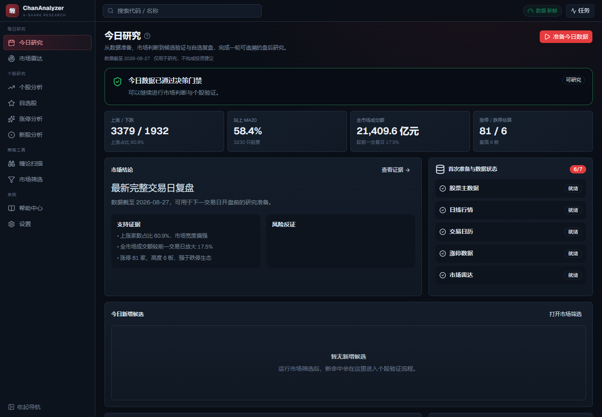
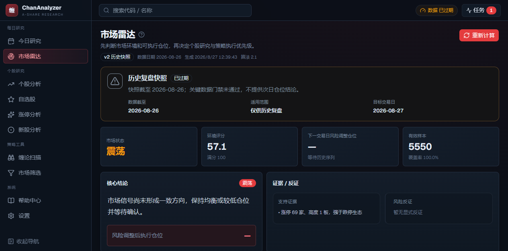
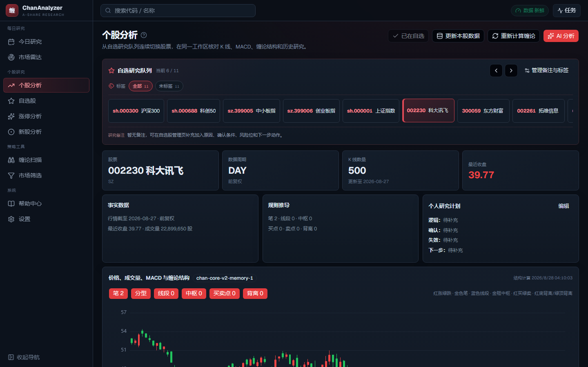
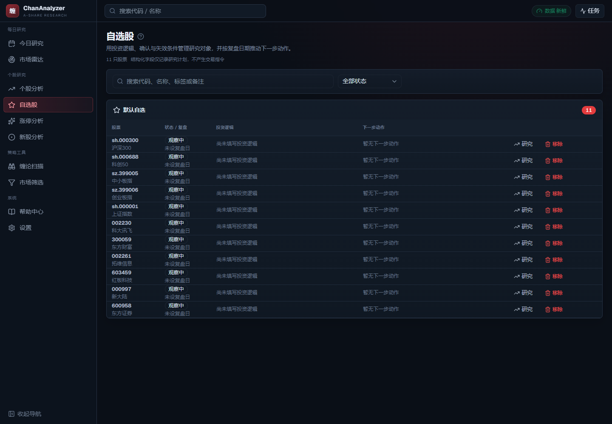
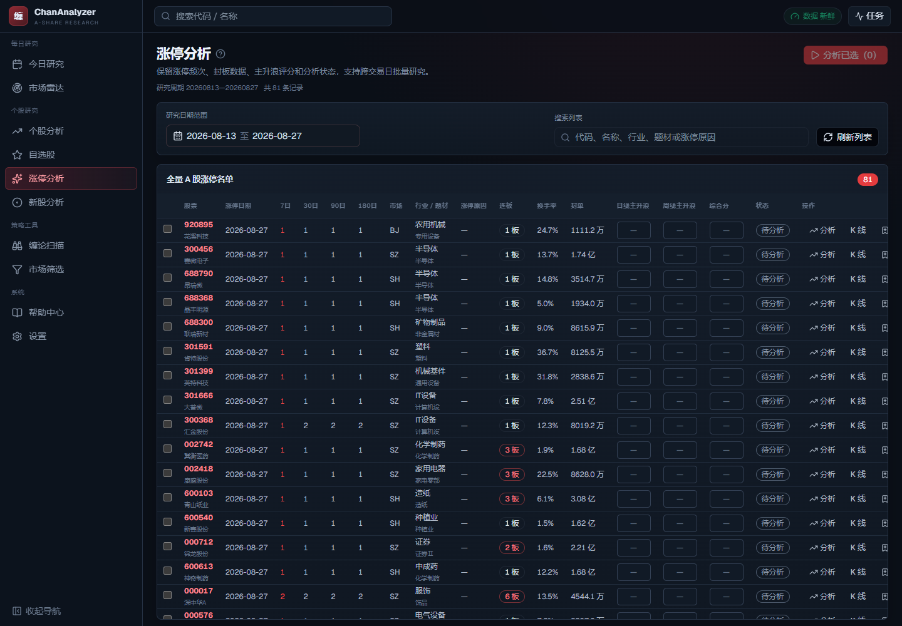
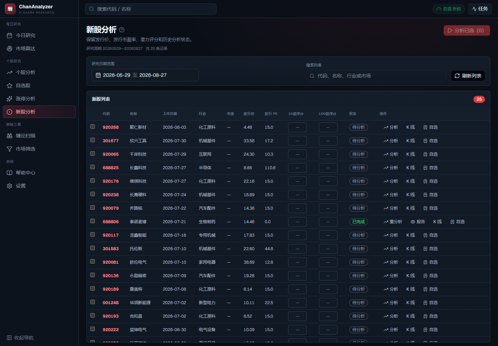
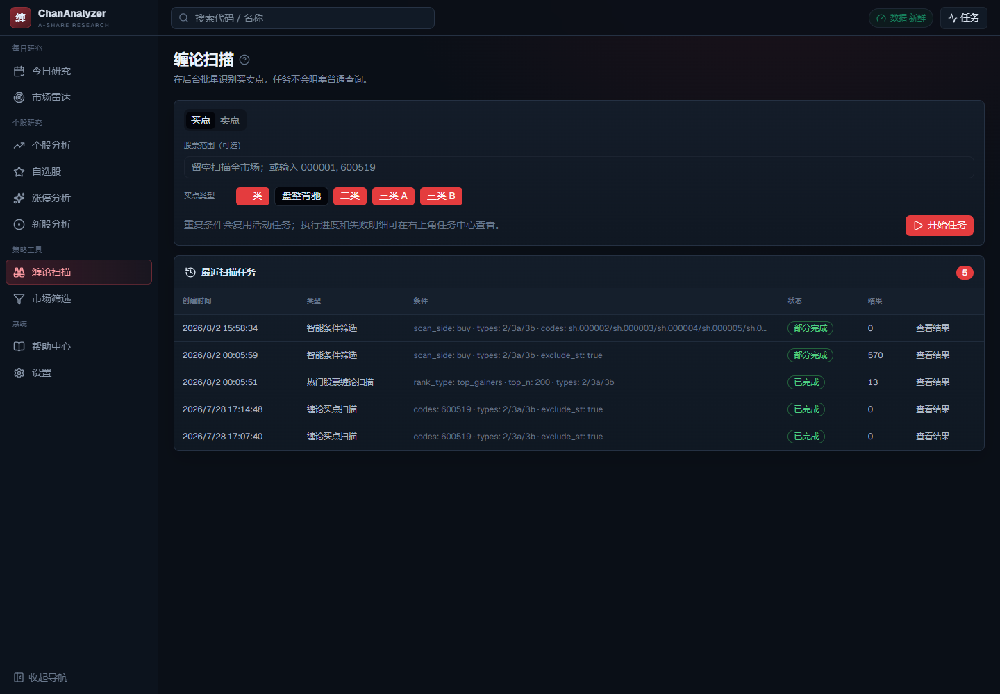
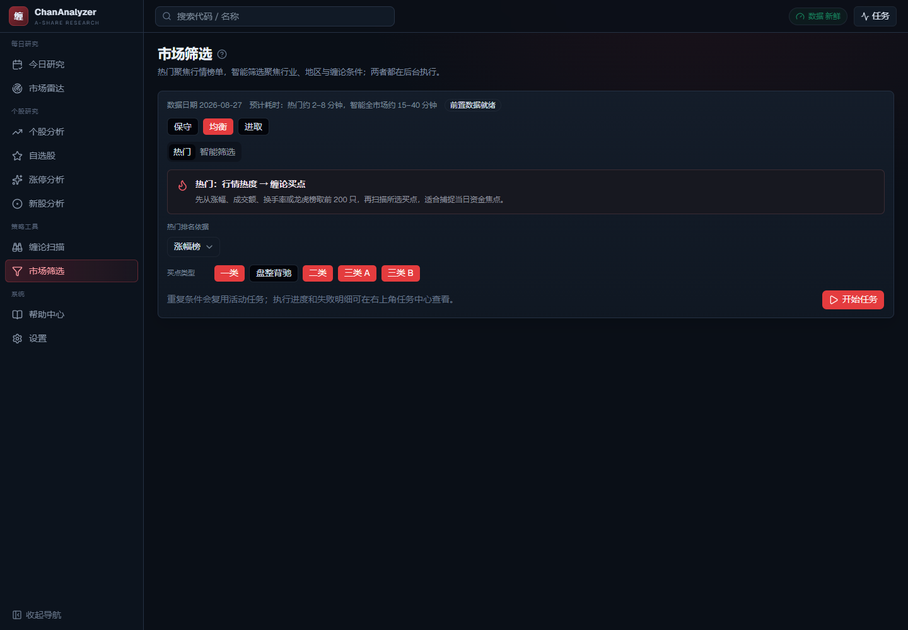
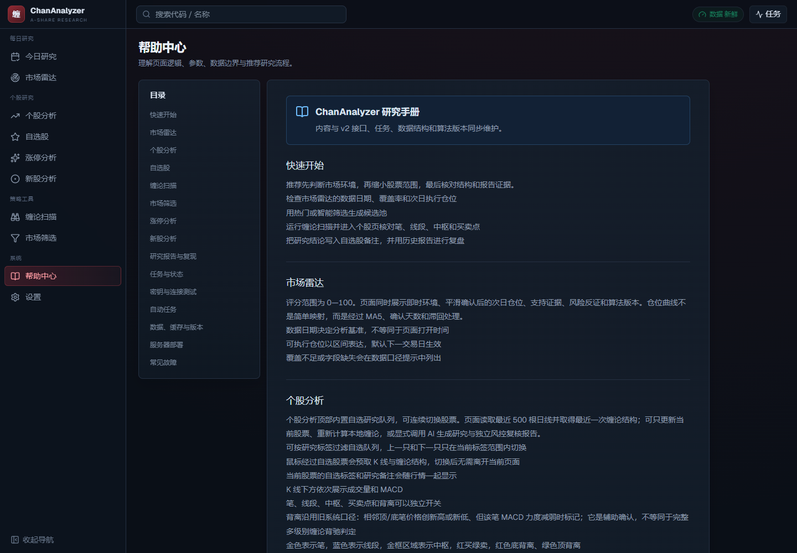
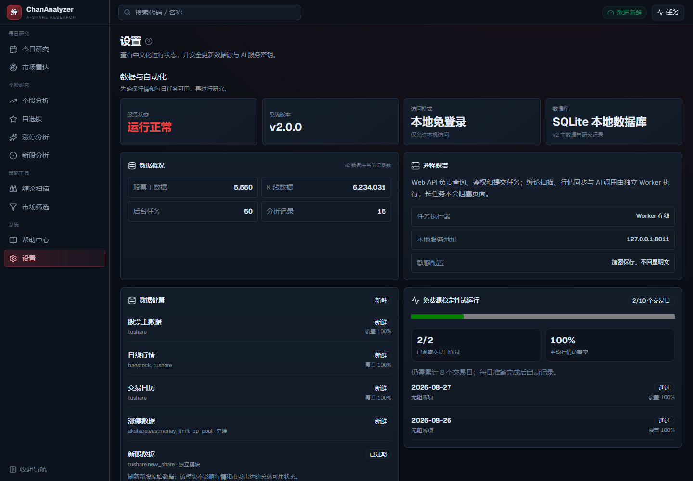

# ChanAnalyzer v2

ChanAnalyzer v2 是面向个人 A 股投资者、可部署到单台服务器的盘后研究与决策辅助工作台。系统将数据准备、市场判断、候选筛选、个股验证、自选研究计划和复盘串成一条可追溯流程，并通过数据健康门禁阻止过期或不完整行情产生可执行结论。

## 项目预览

### 今日研究工作台

集中展示数据是否可用于决策、市场事实与反证、候选股票、自选复盘和待办事项。



### 市场雷达

基于最新完整交易日生成市场状态、证据与反证，并在数据门禁通过后展示下一交易日的研究仓位区间。



### 个股研究

在同一工作区查看前复权 K 线、MACD、缠论结构、事实数据、规则推导和个人研究计划。



<details>
<summary>查看更多主要页面（自选股、事件分析、策略工具与系统页）</summary>

### 自选股研究计划



### 涨停分析



### 新股分析



### 缠论扫描



### 市场筛选



### 帮助中心



### 系统设置



</details>

## 当前架构

```text
React + TypeScript + Vite
          |
      /api/v1 + SSE
          |
FastAPI -> Services -> Repositories -> SQLAlchemy -> SQLite / PostgreSQL
             |              |
             |              +-> Tushare / AI Providers
             +-> Worker -> 纯缠论核心
```

- `backend/app/api`：鉴权、参数校验、序列化和健康检查。
- `backend/app/services`：市场雷达、个股、扫描、涨停、新股、行情同步和任务编排。
- `backend/app/repositories`：数据库访问边界。
- `backend/app/providers`：Tushare、BaoStock、AKShare 降级行情源与 OpenAI 兼容 AI 服务。
- `backend/app/chan_core`：内存算法接口；基于 MIT 许可的
  [`Vespa314/chan.py`](https://github.com/Vespa314/chan.py) 保留的算法固定在
  `vendor`，禁止网络和数据库访问。具体来源与本地改动见
  [`THIRD_PARTY_NOTICES.md`](THIRD_PARTY_NOTICES.md)。
- `backend/app/worker`：持久化后台任务、重试、取消和恢复。
- `frontend`：统一深色研究终端、左侧导航、任务中心和帮助中心。
- `migrations`：Alembic 数据库结构迁移。

## 功能

- 今日研究：数据决策门禁、市场事实与反证、候选变化、自选复盘和研究待办。
- 每日数据准备：交易日、主数据、日线质量检查、涨停和市场雷达按依赖顺序执行，支持去重、断点恢复与任务进度。
- 数据可靠性：统一成交量/成交额单位，记录数据源与复权类型，监控覆盖率、完整刷新时间和阻断原因。
- 市场雷达：市场结论、证据/反证、风险仓位曲线和历史版本。
- 个股研究：自选研究队列、标签筛选、K 线、笔/线段/中枢/买卖点/背离、事实与规则结论和分析历史。
- 市场筛选：热门榜单与按条件组合的智能筛选。
- 缠论扫描：买点、卖点和持久化扫描结果。
- 涨停与新股分析：日期区间、批量任务、评分和版本化 AI 报告。
- 自选研究计划：记录投资逻辑、确认条件、失效条件、下一步动作、复盘日期和研究状态。
- 设置与帮助：中文配置、Secret 脱敏、数据源测试和页面级帮助。

## 本地启动

要求 Python 3.11+、Node.js 20+。

```powershell
py -3.12 -m pip install -e ".[dev]"
cd frontend
npm install
npm run build
cd ..
py -3.12 -m backend.app.start_local
```

访问 `http://127.0.0.1:8011`。本地默认 `AUTH_MODE=local`，只接受本机访问且无需登录。API 与 Worker 是两个独立进程；`start_local` 仅负责同时管理它们。

也可以分别启动：

```powershell
py -3.12 -m backend.app.main
py -3.12 -m backend.app.worker.main
```

## 配置

复制 `.env.example` 为 `.env`。常用项：

```dotenv
AUTH_MODE=local
DATABASE_URL=sqlite:///data/chan_v2.db
API_HOST=127.0.0.1
API_PORT=8011
APP_SECRET_KEY=replace-with-a-stable-random-secret
```

Tushare、DeepSeek 和 SiliconFlow 密钥可在设置页写入；接口只返回是否已配置，不返回明文。当前行情刷新依赖有效的 Tushare Token。

## 数据库与迁移

新安装先执行：

```powershell
py -3.12 -m alembic upgrade head
```

## 开发与验证

```powershell
py -3.12 -m pytest
py -3.12 -m ruff check backend migrations tests
py -3.12 -m mypy --ignore-missing-imports --follow-imports=silent backend/app/core/errors.py backend/app/core/exception_handlers.py backend/app/services/backups.py backend/app/services/structured_ai.py backend/app/services/stock_analysis.py backend/app/services/stock_market_context.py backend/app/services/scan_changes.py backend/app/services/data_health.py backend/app/db/migrations.py backend/app/start_local.py
py -3.12 -m backend.app.export_openapi
cd frontend
npm run generate:api
npm test
npm run lint
npm run build
npm run test:e2e
```

依赖以 `pyproject.toml` 为准；`requirements.txt` 用于服务器直接安装，`pylock.toml` 用于严格复现。本项目不会在未授权时运行 `npm audit`，因为该命令会把依赖元数据发送给 npm。

## 数据来源与使用边界

本项目只提供 Tushare、BaoStock、AKShare 等第三方数据服务的本地接入能力，不授予行情数据的再分发权。使用者应自行遵守各数据源的账号、积分、频率、缓存和展示条款；不要把本地数据库、行情快照或含个人研究记录的备份提交到仓库或作为项目发行物发布。

## 许可证与来源

项目自身采用 [MIT License](LICENSE)。缠论算法核心保留并修改自 MIT 许可的 [`Vespa314/chan.py`](https://github.com/Vespa314/chan.py)，完整来源、版权和本地改动说明见 [THIRD_PARTY_NOTICES.md](THIRD_PARTY_NOTICES.md)。

## 部署

单服务器模式由 Nginx 提供 HTTPS，并用 systemd、Supervisor 或宝塔分别守护 API 与 Worker。服务器使用 `AUTH_MODE=admin`、Secure HttpOnly Cookie、固定 `APP_SECRET_KEY` 和明确的 `ALLOWED_ORIGINS`。详见 `docs/DEPLOYMENT_V2.md`。

## 旧系统清理

v1 源码、虚拟环境、日志、旧数据库、8001 入口及一次性旧库导入器均已永久删除。主工程只保留 v2，历史结构升级统一由 Alembic 管理。

功能迁移、替代和待补项以 `docs/V1_V2_FEATURE_PARITY.md` 为验收基线；旧运行栈退役不等同于旧功能自动验收通过。

## 风险提示

所有结论仅用于研究与软件验证，不构成投资建议。缠论结构、评分和 AI 报告都应结合数据质量、市场环境和个人风险承受能力独立判断。
